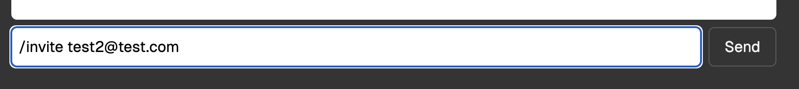

# Drizzle SupaSecureSlack

Example application on how you can use Drizzle to secure a Supabase Realtime Chat application.

It's based on the [SupaSecureSlack](https://github.com/supabase/supabase/tree/master/examples/realtime/nextjs-authorization-demo).

The schema and RLS policy definitions are managed by Drizzle (see [database/schema.ts](./database/schema.ts)).

## Objective

Build a chat system using Realtime Broadcast with Authorized Channels where users can create rooms, invite each other to rooms, and send each other ephemeral messages.

Each room restricts the number of users authorized by applying RLS Policies applied to `public` schema tables you'll be creating and the auto-generated `realtime` schema tables.

## Run It
> [!NOTE]
> This demo works with Supabase locally.
> 
> Install Supabase CLI to self host the demo https://supabase.com/docs/guides/local-development/cli/getting-started

1. Start Supabase locally `supabase start`
2. Create a `.env.local` file with the required variables by running `cp .env.example .env.local`. It already contains all the required environment variables.
   * `ADMIN_DATABASE_URL` uses the full privileged user (postgres). It bypasses all RLS policies.
   * `DATABASE_URL` uses the `rls_client` user. It is granted `anon` and `authenticated` roles.
3. `npm install`
4. `npm run dev`

> [!IMPORTANT]
> A new postgres user `rls_client` with `anon` and `authenticated` roles is created for you by [Supabase seed](./supabase/seed.sql)
> 
> In a real-world application, you should create this user as well and not use the full privileged user.
>
> You should not expose it on the frontend.
> ```sql
> CREATE USER rls_client
> WITH
>    LOGIN PASSWORD 'your_strong_password_for_rls_client';
>
> GRANT anon TO rls_client;
>
> GRANT authenticated TO rls_client;
> ```


## How It Looks

In this scenario both users are able to access it:

And here one of the user does not have access because their RLS policies made the user be denied access


## Schema

We'll be using:

- `public.profiles` - table that will be automatically updated using a trigger when new users are created
- `public.rooms` - a list of all unique rooms created
- `public.rooms_users` - the table responsible for the association between rooms and users

## Drizzle client

In order to use Drizzle with Supabase and RLS, we need to create a custom Drizzle client.

See [`createDrizzle`](./database/drizzle.ts) for more details.

```ts
function createDrizzle<
  Database extends PgDatabase<any, any, any>,
  Token extends SupabaseToken = SupabaseToken
>(token: Token, { admin, client }: { admin: Database; client: Database })
```

> [!NOTE]
> `createDrizzle` exposes the same API as the drizzle-orm client but also includes an `rls` method.
>
> This `rls` method is a `transaction` (from `client`) on which we set the necessary configuration for Supabase to handle RLS.
>
> ```sql
>  -- auth.jwt()
>  select set_config('request.jwt.claims', <stringified token>, TRUE);
>  -- auth.uid()
>  select set_config('request.jwt.claim.sub', <token.sub>, TRUE);
>  -- set local role
>  set local role <token.role ?? "anon">;
> ```

```ts
const config = {
  casing: "snake_case",
  schema,
} satisfies DrizzleConfig<typeof schema>;

// ByPass RLS
const admin = drizzle({
  client: postgres(process.env.ADMIN_DATABASE_URL!, { prepare: false }),
  ...config,
});

// Protected by RLS
const client = drizzle({
  client: postgres(process.env.DATABASE_URL!, { prepare: false }),
  ...config,
});

// This example uses Next.js capabilities
export async function createDrizzleSupabaseClient() {
  const {
    data: { session },
  } = await createClient().auth.getSession();
  // Decode the access token on your own (from Supabase client, custom session cookie, etc.).
  const token = decode(session?.access_token ?? "");

  return createDrizzle(token, { admin, client });
}
```

### Protected by RLS
> [!IMPORTANT]
> RLS policies are only applied on `.rls` queries.
> 

```ts
// In your Next.js server-side code
const db = await createDrizzleSupabaseClient();

const [user] = await db.rls((tx) =>
  tx.select().from(profiles).where(eq(profiles.email, email))
);
```

### Bypass RLS
```ts
// In your Next.js server-side code
const db = await createDrizzleSupabaseClient();

const [user] = await db.select().from(profiles).where(eq(profiles.email, email));
```

## Database Setup

### Tables and RLS Policies

```ts
import { sql, exists, and, eq, inArray } from "drizzle-orm";
import {
  bigint,
  foreignKey,
  pgTable,
  text,
  timestamp,
  unique,
  uuid,
  pgPolicy,
} from "drizzle-orm/pg-core";
import {
  authenticatedRole,
  authUid,
  authUsers,
  realtimeMessages,
  realtimeTopic,
  supabaseAuthAdminRole,
} from "drizzle-orm/supabase";

export const rooms = pgTable(
  "rooms",
  {
    id: bigint({ mode: "number" }).primaryKey().generatedByDefaultAsIdentity(),
    topic: text().notNull(),
  },
  (table) => [
    unique("rooms_topic_key").on(table.topic),
    pgPolicy("authenticated can read rooms", {
      for: "select",
      to: authenticatedRole,
      using: sql`true`,
    }),
    pgPolicy("authenticated can add rooms", {
      for: "insert",
      to: authenticatedRole,
      withCheck: sql`true`,
    }),
  ]
);

export const profiles = pgTable(
  "profiles",
  {
    id: uuid().primaryKey().notNull(),
    email: text().notNull(),
  },
  (table) => [
    foreignKey({
      columns: [table.id],
      foreignColumns: [authUsers.id],
      name: "profiles_id_fk",
    }).onDelete("cascade"),
    pgPolicy("authenticated can view all profiles", {
      for: "select",
      to: authenticatedRole,
      using: sql`true`,
    }),
    pgPolicy("supabase_auth_admin can insert profile", {
      for: "insert",
      to: supabaseAuthAdminRole,
      withCheck: sql`true`,
    }),
  ]
);

export const roomsUsers = pgTable(
  "rooms_users",
  {
    userId: uuid().notNull(),
    roomTopic: text().notNull(),
    joinedAt: timestamp({
      mode: "string",
      precision: 3,
    })
      .notNull()
      .defaultNow(),
  },
  (table) => [
    foreignKey({
      columns: [table.userId],
      foreignColumns: [authUsers.id],
      name: "rooms_users_user_id_fk",
    }),
    foreignKey({
      columns: [table.roomTopic],
      foreignColumns: [rooms.topic],
      name: "rooms_users_room_topic_fk",
    }),
    pgPolicy("authenticated can read rooms_users", {
      for: "select",
      to: authenticatedRole,
      using: sql`true`,
    }),
    pgPolicy("authenticated can add rooms_users", {
      for: "insert",
      to: authenticatedRole,
      withCheck: sql`true`,
    }),
  ]
);

// This is how you define a policy for an external table.
export const RealtimeReadPolicy = pgPolicy(
  "authenticated can read broadcast and presence state",
  {
    for: "select",
    to: authenticatedRole,
    using: exists(
      sql`(
      select 1 from ${roomsUsers} where 
      ${and(
        eq(roomsUsers.userId, authUid),
        eq(roomsUsers.roomTopic, realtimeTopic),
        inArray(realtimeMessages.extension, [
          "presence",
          "broadcast",
        ])
      )}
    )`
    ),
  }
).link(realtimeMessages);

export const RealtimeWritePolicy = pgPolicy(
  "authenticated can send broadcast and track presence",
  {
    for: "insert",
    to: authenticatedRole,
    withCheck: exists(
      sql`(
      select 1 from ${roomsUsers} where 
      ${and(
        eq(roomsUsers.userId, authUid),
        eq(roomsUsers.roomTopic, realtimeTopic),
        inArray(realtimeMessages.extension, [
          "presence",
          "broadcast",
        ])
      )}
    )`
    ),
  }
).link(realtimeMessages);

```

### Create Database Function and Trigger

> [!NOTE]
> This is handled by a custom migration.

We need to create a database function and trigger to add an entry to `public.profiles` whenever a new user is created:

```sql
CREATE OR REPLACE FUNCTION insert_user() RETURNS TRIGGER AS
$$
  BEGIN
    INSERT INTO public.profiles (id, email) VALUES (NEW.id, NEW.email); RETURN NEW;
  END;
$$ LANGUAGE plpgsql
   SECURITY DEFINER
   SET search_path = public;

CREATE OR REPLACE TRIGGER "on_new_auth_create_profile"
AFTER INSERT ON auth.users FOR EACH ROW
EXECUTE FUNCTION insert_user();

GRANT EXECUTE ON FUNCTION insert_user () TO supabase_auth_admin;
GRANT INSERT ON TABLE public.profiles TO supabase_auth_admin;
```

## Coding Concerns

* Check that you're using `@supabase/realtime-js` v2.44.0 or later. 
* You need to define that the channel is private using the new configuration field during channel creation:

```typescript
  const channel = supabase.channel('room-1', {
    config: { private: true },
  })
```

You can check `app/protected/page.tsx` to see how we've set it up in the demo.

## Adding user to channel

Type `/invite <email>` of an existing user and they will be added to the channel.


